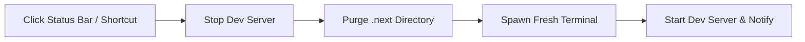

# Next.js Clean Restart

**Next.js Clean Restart** (`next-clean-restart`) is a powerful Visual Studio Code extension that eliminates Next.js build cache corruption and stale dev server states with a single click.

It adds a dedicated button to your VS Code Status Bar that gracefully stops your running Next.js development server, recursively purges the `.next` cache directory (with built-in file lock retry mechanisms for Windows), and spins up a fresh development server in an integrated terminal.

---

## ✨ Features

- **⚡ One-Click Status Bar Action**: Quick access button in the bottom status bar (`$(sync) Clean & Restart Next.js`).
- **🛑 Graceful Dev Server Termination**: Sends `SIGINT` (`Ctrl+C`) to the dedicated Next.js terminal and safely disposes of the process before deleting cache.
- **🧹 Recursive `.next` Cache Deletion**: Cleans out corrupted `.next` cache files, trace logs, and Turbopack temporary artifacts.
- **🛡️ Windows File-Lock Resilience**: Automatically retries cache directory deletion with configurable backoff to overcome Windows `EBUSY` / `EPERM` file locking issues.
- **📦 Smart Package Manager Detection**: Auto-detects whether your project uses **pnpm**, **yarn**, **bun**, or **npm** based on lockfiles, and executes the appropriate dev command (`pnpm dev`, `yarn dev`, `bun dev`, `npm run dev`).
- **🏢 Monorepo & Multi-Project Support**: Seamlessly works with Turborepo, Nx, and pnpm workspace monorepos (e.g. `apps/web`, `apps/docs`). If multiple Next.js apps exist, it resolves to your active editor or prompts a QuickPick selector.
- **⌨️ Keyboard Shortcut**: Trigger instant clean restart with <kbd>Ctrl</kbd> + <kbd>Alt</kbd> + <kbd>N</kbd> (or <kbd>Cmd</kbd> + <kbd>Alt</kbd> + <kbd>N</kbd> on macOS).

---

## 🚀 How It Works



1. **Detection**: The extension detects Next.js projects via `next.config.*` files or `next` dependencies in `package.json`.
2. **Stop**: Locates the dedicated integrated terminal (default: `"Next.js Dev Server"`), sends `Ctrl+C`, and releases process handles.
3. **Purge**: Deletes `.next` using VS Code's file system API with automatic retry backoff.
4. **Restart**: Creates or targets the integrated terminal in the project root and runs the dev script (`pnpm dev`, `npm run dev`, etc.).
5. **Notification**: Displays progress in a toast notification with a quick button to view the terminal.

---

## ⌨️ Commands & Keybindings

| Command | Title | Default Shortcut |
| :--- | :--- | :--- |
| `nextCleanRestart.cleanRestart` | **Next.js: Clean & Restart Dev Server** | <kbd>Ctrl</kbd>+<kbd>Alt</kbd>+<kbd>N</kbd> / <kbd>Cmd</kbd>+<kbd>Alt</kbd>+<kbd>N</kbd> |
| `nextCleanRestart.cleanOnly` | **Next.js: Clean .next Cache Only** | — |
| `nextCleanRestart.restartOnly` | **Next.js: Restart Dev Server Only** | — |

---

## ⚙️ Configuration Settings

Configure these settings in your VS Code `settings.json` or through the Settings UI (`Ctrl+,`):

| Setting | Type | Default | Description |
| :--- | :--- | :--- | :--- |
| `nextCleanRestart.devCommand` | `string` | `"auto"` | Custom CLI command to run (e.g. `"pnpm dev --turbo"`). Set to `"auto"` for automatic package manager detection. |
| `nextCleanRestart.showConfirmation` | `boolean` | `false` | When enabled, prompts for confirmation before purging `.next` and restarting. |
| `nextCleanRestart.terminalName` | `string` | `"Next.js Dev Server"` | Name of the integrated terminal used for the Next.js process. |
| `nextCleanRestart.showStatusBarItem` | `boolean` | `true` | Show or hide the status bar button. |
| `nextCleanRestart.cacheDirectory` | `string` | `".next"` | Relative path to the Next.js cache directory to delete. |
| `nextCleanRestart.retryAttempts` | `number` | `5` | Maximum retry attempts for deleting cache if files are locked by the OS. |
| `nextCleanRestart.retryDelayMs` | `number` | `300` | Delay in milliseconds between retry attempts. |
| `nextCleanRestart.focusTerminalOnStart` | `boolean` | `false` | Whether to automatically focus the integrated terminal on restart. |

### Example Settings

```json
{
  "nextCleanRestart.devCommand": "pnpm dev --turbo",
  "nextCleanRestart.showConfirmation": false,
  "nextCleanRestart.terminalName": "Next.js Dev Server",
  "nextCleanRestart.retryAttempts": 5,
  "nextCleanRestart.retryDelayMs": 300
}
```

---

## 🏗️ Monorepo & Turborepo Usage

In monorepos with multiple Next.js apps (e.g. `apps/web` and `apps/admin`):
- The status bar indicates the number of detected apps: `$(sync) Clean & Restart Next.js (2)`.
- If an editor file from `apps/web` is currently focused, clicking Clean & Restart will automatically target `apps/web`.
- If no editor file is focused, a QuickPick menu lets you select which project to restart.

---

## 🛠️ Development & Contributing

### Prerequisites
- Node.js >= 18.0.0
- npm >= 9.0.0

### Build & Test
```bash
# Install dependencies
npm install

# Compile TypeScript
npm run compile

# Run automated tests
npm test

# Build production bundle with esbuild
npm run package
```

### Debugging in VS Code
Press <kbd>F5</kbd> in VS Code to launch a new **Extension Development Host** window with the extension loaded.

---

## 📄 License

MIT License.
