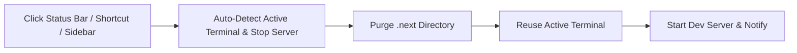

# Next.js Clean Restart

**Next.js Clean Restart** (`next-clean-restart`) is a Visual Studio Code extension that eliminates Next.js build cache corruption and stale dev server states with a single click.

It provides a Status Bar action button and a dedicated Sidebar tab to gracefully stop running Next.js development servers, recursively purge the `.next` cache directory (with built-in file lock retry mechanisms for Windows), and restart a fresh dev server in your active terminal without opening duplicate tabs.

---

## Disclaimer

This extension was **vibecoded** with AI. It is designed for fast, seamless Next.js developer workflows. If you run into any edge cases, bugs, or have feature ideas, feel free to open an issue or submit a pull request on GitHub!

---

## Installation

1. Download the latest `.vsix` package from [GitHub Releases](https://github.com/Eugee29/next-clean-restart/releases/latest).
2. Install the extension using any of the following methods:

### Option A: Via VS Code Extensions View
1. Open VS Code.
2. Go to the **Extensions** view (<kbd>Ctrl+Shift+X</kbd> / <kbd>Cmd+Shift+X</kbd>).
3. Click the **`...`** (Views and More Actions) menu in the top-right corner of the Extensions panel.
4. Select **Install from VSIX...**.
5. Choose the downloaded `next-clean-restart-1.3.0.vsix` file.

### Option B: Via Command Palette
1. Open the Command Palette (<kbd>Ctrl+Shift+P</kbd> / <kbd>Cmd+Shift+P</kbd>).
2. Type and select `Extensions: Install from VSIX...`.
3. Choose the downloaded `.vsix` file.

### Option C: Via Terminal / Command Line
```bash
code --install-extension next-clean-restart-1.3.0.vsix
```

> **For Cursor or VSCodium:**
> ```bash
> cursor --install-extension next-clean-restart-1.3.0.vsix
> # or
> codium --install-extension next-clean-restart-1.3.0.vsix
> ```

---

## Features

- **Activity Bar Sidebar Tab**: Dedicated view in the VS Code sidebar featuring quick actions, live detected project details, and click-to-edit configuration settings.
- **Auto-Detect Active Terminal**: Automatically identifies and targets your currently focused/active terminal window or running Next.js dev server.
- **Terminal Reuse**: Reuses your existing running integrated terminal instead of spawning duplicate terminal tabs on every restart.
- **Keyboard Shortcut Customization**: Click the Keyboard Shortcut item directly in the sidebar to open the VS Code shortcut manager pre-filtered.
- **One-Click Status Bar Action**: Quick access button in the bottom status bar (`$(sync) Clean & Restart Next.js`).
- **Graceful Dev Server Termination**: Sends `SIGINT` (`Ctrl+C`) to the running Next.js process and safely releases file handles before deleting cache.
- **Recursive `.next` Cache Deletion**: Cleans out corrupted `.next` cache files, trace logs, and Turbopack temporary artifacts.
- **Windows File-Lock Resilience**: Automatically retries cache directory deletion with configurable backoff to overcome Windows `EBUSY` / `EPERM` file locking issues.
- **Smart Package Manager Detection**: Auto-detects whether your project uses **pnpm**, **yarn**, **bun**, or **npm** based on lockfiles, and executes the appropriate dev command (`pnpm dev`, `yarn dev`, `bun dev`, `npm run dev`).
- **Monorepo & Multi-Project Support**: Seamlessly works with Turborepo, Nx, and pnpm workspace monorepos (e.g. `apps/web`, `apps/docs`). If multiple Next.js apps exist, it resolves to your active editor or prompts a QuickPick selector.
- **Default Shortcut**: Trigger instant clean restart with <kbd>Ctrl</kbd> + <kbd>Alt</kbd> + <kbd>N</kbd> (or <kbd>Cmd</kbd> + <kbd>Alt</kbd> + <kbd>N</kbd> on macOS).

---

## How It Works



1. **Detection**: Detects Next.js projects via `next.config.*` files or `next` dependencies in `package.json`.
2. **Terminal Resolution**: Automatically targets the focused active terminal or dedicated dev terminal.
3. **Stop**: Sends `Ctrl+C` to the target terminal and releases process handles.
4. **Purge**: Deletes `.next` using VS Code's file system API with automatic retry backoff.
5. **Restart**: Executes the dev script in the same active terminal (`pnpm dev`, `npm run dev`, etc.).
6. **Notification**: Displays progress in a toast notification with a quick button to view the terminal.

---

## Sidebar View & Interactive Settings

The extension contributes a dedicated view to the VS Code Activity Bar:

- **Quick Actions**: Clean & Restart, Clean Cache Only, Restart Only, Focus Running Dev Terminal.
- **Detected Projects**: Displays detected Next.js projects, package manager, dev script, and `.next` folder status.
- **Interactive Configuration**:
  - **Keyboard Shortcut**: Click to open VS Code Keyboard Shortcuts manager pre-filtered to customize your key combinations.
  - **Target Terminal**: Shows live active terminal (e.g., `auto (Active: powershell)`). Click to choose auto-detect, pick an open terminal, or specify a custom name.
  - **Reuse Running Terminal**: Click to toggle `Enabled` / `Disabled`.
  - **Dev Command**: Click to edit custom CLI command or set to `"auto"`.
  - **Show Confirmation**: Click to toggle confirmation prompt.
  - **Status Bar Button**: Click to toggle status bar visibility.
  - **Cache Directory**: Click to change target cache folder.
  - **File Lock Retries**: Click to adjust retry attempts and backoff delay.

---

## Commands & Keybindings

| Command | Title | Default Shortcut |
| :--- | :--- | :--- |
| `nextCleanRestart.cleanRestart` | **Next.js: Clean & Restart Dev Server** | <kbd>Ctrl</kbd>+<kbd>Alt</kbd>+<kbd>N</kbd> / <kbd>Cmd</kbd>+<kbd>Alt</kbd>+<kbd>N</kbd> |
| `nextCleanRestart.cleanOnly` | **Next.js: Clean .next Cache Only** | — |
| `nextCleanRestart.restartOnly` | **Next.js: Restart Dev Server Only** | — |
| `nextCleanRestart.focusTerminal` | **Next.js: Focus Dev Terminal** | — |
| `nextCleanRestart.configureKeybinding` | **Next.js: Configure Keyboard Shortcuts** | — |
| `nextCleanRestart.selectActiveTerminal` | **Next.js: Select Target Terminal** | — |
| `nextCleanRestart.refreshSidebar` | **Refresh Next.js Projects & Settings** | — |

---

## Configuration Settings

Configure these settings in the extension sidebar, via VS Code `settings.json`, or in the Settings UI (`Ctrl+,`):

| Setting | Type | Default | Description |
| :--- | :--- | :--- | :--- |
| `nextCleanRestart.terminalName` | `string` | `"auto"` | Name of the target integrated terminal, or `"auto"` to automatically detect the currently active terminal or running dev server. |
| `nextCleanRestart.reuseTerminal` | `boolean` | `true` | Reuse the existing running integrated terminal instead of creating a new terminal tab on each restart. |
| `nextCleanRestart.devCommand` | `string` | `"auto"` | Custom CLI command to run (e.g. `"pnpm dev --turbo"`). Set to `"auto"` for automatic package manager detection. |
| `nextCleanRestart.showConfirmation` | `boolean` | `false` | When enabled, prompts for confirmation before purging `.next` and restarting. |
| `nextCleanRestart.showStatusBarItem` | `boolean` | `true` | Show or hide the status bar button. |
| `nextCleanRestart.cacheDirectory` | `string` | `".next"` | Relative path to the Next.js cache directory to delete. |
| `nextCleanRestart.retryAttempts` | `number` | `5` | Maximum retry attempts for deleting cache if files are locked by the OS. |
| `nextCleanRestart.retryDelayMs` | `number` | `300` | Delay in milliseconds between retry attempts. |
| `nextCleanRestart.focusTerminalOnStart` | `boolean` | `false` | Whether to automatically focus the integrated terminal on restart. |

---

## Monorepo & Turborepo Usage

In monorepos with multiple Next.js apps (e.g. `apps/web` and `apps/admin`):
- The sidebar lists each detected app individually with quick action buttons.
- The status bar indicates the number of detected apps: `$(sync) Clean & Restart Next.js (2)`.
- If an editor file from `apps/web` is currently focused, clicking Clean & Restart will automatically target `apps/web`.
- If no editor file is focused, a QuickPick menu lets you select which project to restart.

---

## Development & Contributing

### Prerequisites
- Node.js >= 18.0.0
- npm >= 9.0.0

### Build & Test
```bash
# Install dependencies
npm install

# Compile TypeScript
npm run compile

# Run automated tests
npm test

# Build production bundle with esbuild
npm run package
```

### Debugging in VS Code
Press <kbd>F5</kbd> in VS Code to launch a new **Extension Development Host** window with the extension loaded.

---

## License

MIT License.
